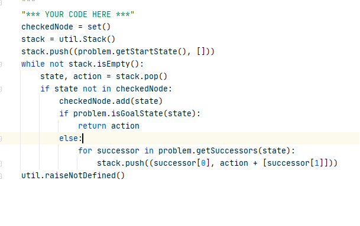
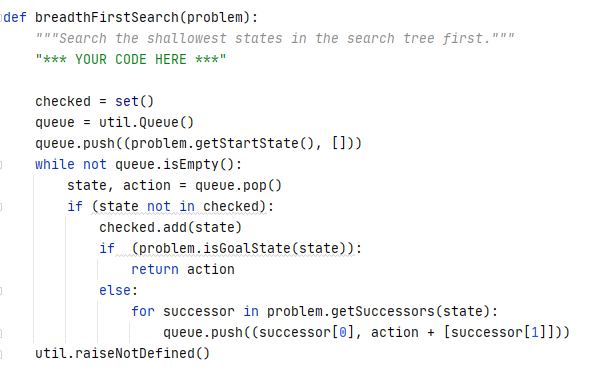
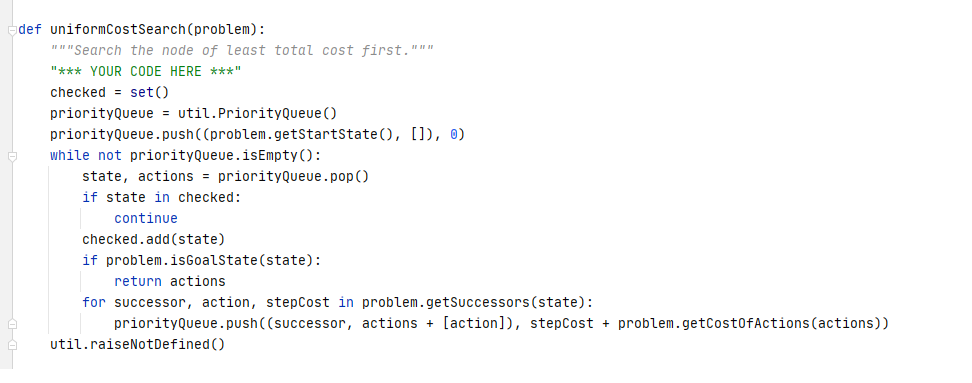
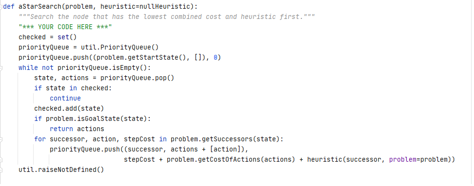
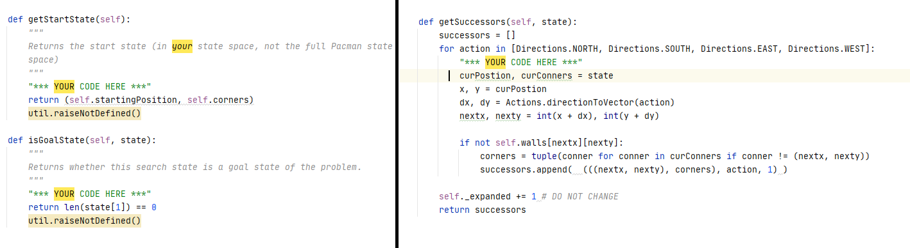

# INT3401-8
Trí tuệ nhân tạo - Bài tập
# **PACMAN SEARCH**
## **Mô tả cách làm**
### **Question 1** : Finding a Fixed Food Dot using Depth First Search 
 

 
Sử dụng giải thuật tìm kiếm theo chiều sâu(DFS): 

 
Các biến sử dụng:

 
 checkedNode : Khởi tạo set dùng để lưu trữ các node đã duyệt

 
stack: Ngăn xếp dùng để lưu trữ các node để duyệt DFS

 
state: Lưu trữ để thể hiện trạng thái hiện tại

 
action: Hành động của pacman

 
Thuật toán: Duyệt DFS tất cả các node cho đến khi đến trạng thái cuối cùng

### **Question 2** : Breadth First Search (Tìm kiếm theo chiều rộng )

 

 Giống với Question 1 nhưng ta dùng Queue để lưu trữ duyệt Node

### **Question 3** : Varying the Cost Function 
 

### **Question 4** :  A* search 
 

### **Question 5** : Finding All the Corners
 
 
### **Question 6** : Corners Problem: Heuristic
### **Question 7** : Eating All The Dots
### **Question 8** :  Suboptimal Search
    
